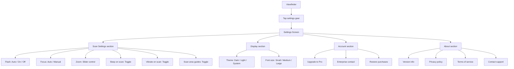
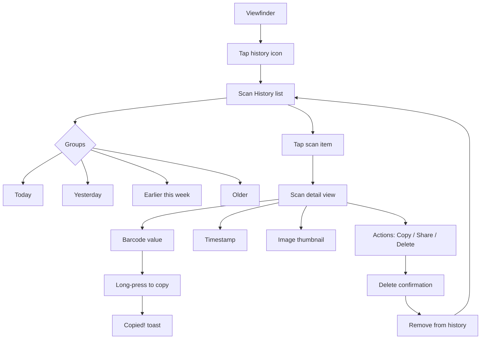

# PeekScan User Flows

## Flow 1: Free Trial → Scan → Upgrade

```mermaid
flowchart TD
    A[App Launch] --> B{First Launch?}
    B -->|Yes| C[Onboarding: 3 screens]
    B -->|No| D[Camera Viewfinder]
    
    C --> D
    
    D --> E{Free tier?}
    E -->|Yes| F{Scans today < 5?}
    E -->|No| G[Full access]
    
    F -->|Yes - 4 or fewer| H[Start scanning]
    F -->|No - reached limit| I[Show upgrade prompt]
    
    H --> J[Point at barcode/QR]
    J --> K[Live camera with scan area]
    K --> L{Code detected?}
    L -->|Yes| M[Auto-decode through seal]
    L -->|No| N[Show guidance: "Hold steady"]
    N --> K
    
    M --> O[Show scan result]
    O --> P{Valid result?}
    P -->|Yes| Q[Show decoded data + copy]
    P -->|No| R[Error: retry or manual entry]
    
    R --> H
    
    Q --> S[Options: Copy / Share / Save to History]
    S --> T[Return to viewfinder]
    T --> D
    
    I --> U[Upgrade screen]
    U --> V{Choose option}
    V -->|One-time $4.99| W[Mobile payment flow]
    V -->|Enterprise $10/seat/mo| X[Contact sales form]
    
    W --> Y[Unlock unlimited scans]
    X --> Z[Enterprise inquiry submitted]
    Y --> D
    Z --> D
```

## Flow 2: Scan Error Handling

```mermaid
flowchart TD
    A[Viewfinder active] --> B[Camera feed analyzing]
    B --> C{Code found?}
    C -->|No for 5s| D[Show "No code detected" toast]
    D --> E{Suggestions:}
    E --> F1[Adjust lighting]
    E --> F2[Toggle flash on]
    E --> F3[Move closer/farther]
    E --> F4[Use manual focus]
    F1 --> G[Retry scanning]
    F2 --> G
    F3 --> G
    F4 --> G
    G --> B
    
    C -->|Partial read| H[Show "Enhancing..." status]
    H --> I[Vision pipeline processing]
    I --> J{Decoded?}
    J -->|Yes| K[Show result]
    J -->|No| L[Show "Code obscured" dialog]
    L --> M1[Try removing covering if possible]
    L --> M2[Enter barcode manually]
    L --> M3[Save photo for later]
    M1 --> G
    M2 --> N[Manual entry screen]
    M3 --> O[Photo saved to gallery]
    N --> K
```

## Flow 3: Settings & Configuration



## Flow 4: Scan History

